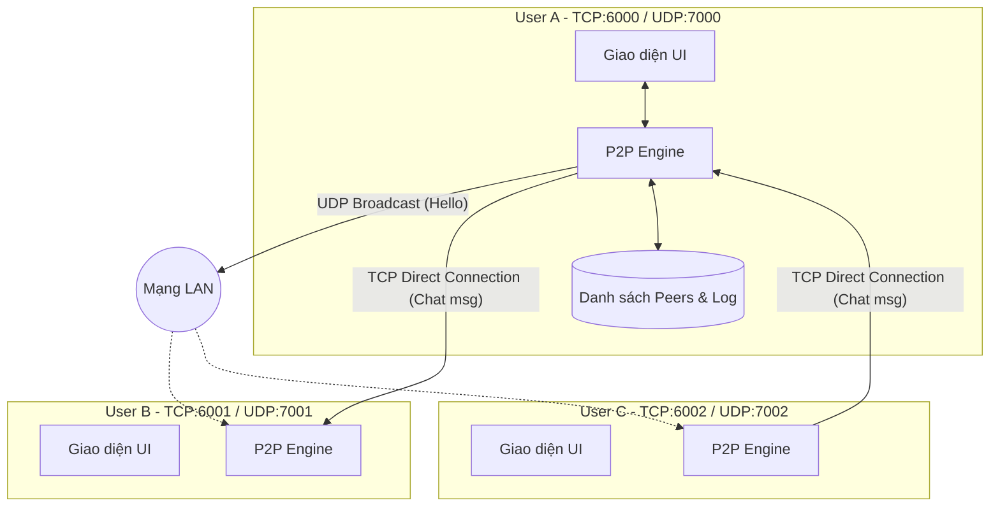
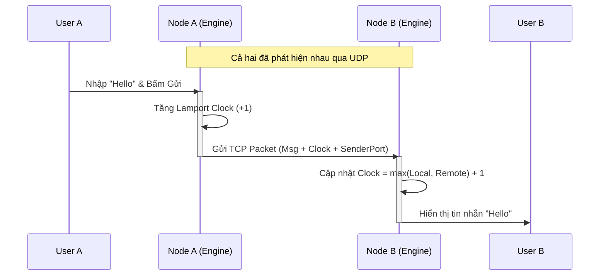

# Kiến Trúc Hệ Thống P2P Chat Phân Tán

## 1. Tổng Quan
Hệ thống được xây dựng theo mô hình **Phân tán hoàn toàn (Fully Decentralized Peer-to-Peer)**, không phụ thuộc vào bất kỳ máy chủ trung gian nào. Các node (người dùng) trong mạng đóng vai trò bình đẳng, vừa là client vừa là server, tự động phát hiện và kết nối với nhau để trao đổi thông tin.

### Đặc điểm nổi bật của Hệ Phân Tán trong dự án:
- **No Single Point of Failure:** Không có server trung tâm, một node chết không ảnh hưởng toàn mạng.
- **Event Ordering (Lamport Clock):** Sử dụng đồng hồ logic Lamport để sắp xếp thứ tự tin nhắn trong môi trường phân tán, giải quyết vấn đề đồng bộ thời gian vật lý giữa các máy.
- **Dynamic Discovery:** Cơ chế tự động phát hiện tham gia/rời mạng.

---

## 2. Sơ Đồ Kiến Trúc (Architecture Diagram)

Dưới đây là sơ đồ luồng dữ liệu và sự tương tác giữa các node trong mạng:



---

## 3. Chi Tiết Kỹ Thuật

### A. Lớp Discovery (Cơ chế phát hiện - UDP)
Sử dụng giao thức **UDP Broadcast** để các node tìm thấy nhau mà không cần cấu hình IP thủ công.

- **Cổng (Port):** Dải cổng `7000 - 7010`.
- **Cơ chế:**
  - **Broadcaster:** Mỗi node định kỳ (mặc định 5s) gửi gói tin `HELLO` tới toàn mạng (`255.255.255.255`).
  - **Listener:** Mỗi node lắng nghe trên cổng UDP của mình. Khi nhận được gói `HELLO` từ IP lạ, nó sẽ thêm vào danh sách `Peers`.
  - **Failure Detection:** Một tiến trình chạy ngầm (Heartbeat Check) sẽ kiểm tra thời gian lần cuối nhận được tín hiệu từ Peer. Nếu quá 15s không thấy phản hồi -> Đánh dấu **Offline**.

### B. Lớp Communication (Trao đổi tin nhắn - TCP)
Sử dụng **TCP Socket** để đảm bảo tin nhắn được gửi đi tin cậy (Reliable).

- **Cổng (Port):** Dải cổng `6000 - 6010` (Tương ứng với từng Process).
- **Cơ chế:**
  - Kết nối được thiết lập theo nhu cầu (**On-demand Short-lived connection**).
  - Khi gửi tin: Mở kết nối -> Gửi JSON -> Đóng kết nối.
  - Mỗi tin nhắn đều kèm theo định danh người gửi và thông tin đồng bộ hóa.

### C. Đồng Bộ Hóa Hệ Phân Tán (Distributed Synchronization)
Hệ thống sử dụng **Lamport Logical Clock** để xác định thứ tự nhân quả (causal ordering) của các sự kiện, do thời gian vật lý của các máy không đồng bộ hoàn toàn.

Quy tắc cập nhật đồng hồ:
1. **Local Event / Send:** `Clock = Clock + 1`
2. **Receive Event:** `Clock = max(Local_Clock, Received_Clock) + 1`

Điều này đảm bảo nếu bản tin A là nguyên nhân của bản tin B, thì `Clock(A) < Clock(B)` trên toàn hệ thống.

---

## 4. Luồng Hoạt Động (Sequence Diagram)

Ví dụ quá trình Node A gửi tin nhắn cho Node B:



---

## 5. Cấu Trúc Dữ Liệu (Payload Structure)

### Gói tin Discovery (UDP)
Được broadcast định kỳ để thông báo sự hiện diện.
```json
{
  "type": "HELLO",
  "user": "HuyNguyen",
  "port": 6000  // Cổng TCP để các node khác kết nối tới
}
```

### Gói tin Chat (TCP)
Chứa nội dung tin nhắn và metadata phân tán.
```json
{
  "type": "CHAT",          // Hoặc "GROUP"
  "msg_id": "uuid-v4...",  // ID duy nhất của tin nhắn
  "sender": "HuyNguyen",
  "content": "Xin chào, kết nối nhé!",
  "timestamp": 1703581200.5,
  "lamport_clock": 12,     // Đồng hồ logic thời điểm gửi
  "sender_port": 6000      // Cổng của người gửi để định danh ngược lại
}
```

## 6. Sơ Đồ Triển Khai (Deployment)
Trong môi trường Demo (`run_demo.py`), hệ thống mô phỏng 3 node trên cùng 1 máy (localhost) bằng cách sử dụng các cổng khác nhau:

| Node | TCP Port | UDP Port |
|------|----------|----------|
| 1    | 6000     | 7000     |
| 2    | 6001     | 7001     |
| 3    | 6002     | 7002     |

Trong thực tế mạng LAN, mỗi máy sẽ chạy trên cùng một cổng mặc định (ví dụ TCP 6000, UDP 7000) và phân biệt nhau bằng địa chỉ IP.
